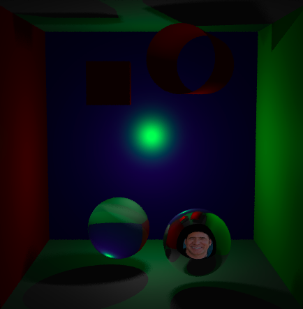

# Raytracer rendering engine
authors: Paul Godbert and Laurant Bouchard

  

# Description
this program is a basic raytracing renderer implementing the following features:

### 1: shapes defined
-  spheres
-  Quads
-  Cylinders
-  arbitrary mesh

### 2: rendering features
- basic shading using the blinn-phong model
- point and spherical lights
- colored lights (every type of light can have a color)
- reflections
- refractions
- hard shadows
- soft shadows (only computed with spherical lights)

### 3: Accelerative structures :
- AABB calculation for all shapes
- Naïve AABB container
- BVH

# Build
this project is built using CMAKE
`qsddqsd`

Additional notes: 
please note that this is a CPU-based raytracer, so it does not apply to real-time-rendering

this renderer was made for our Computer Graphics class at the University of Montreal, during our final year as undergraduates (2024). 
The main structure of the renderer has been written prior to our contribution. 
